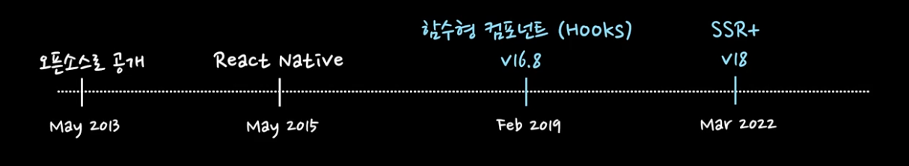
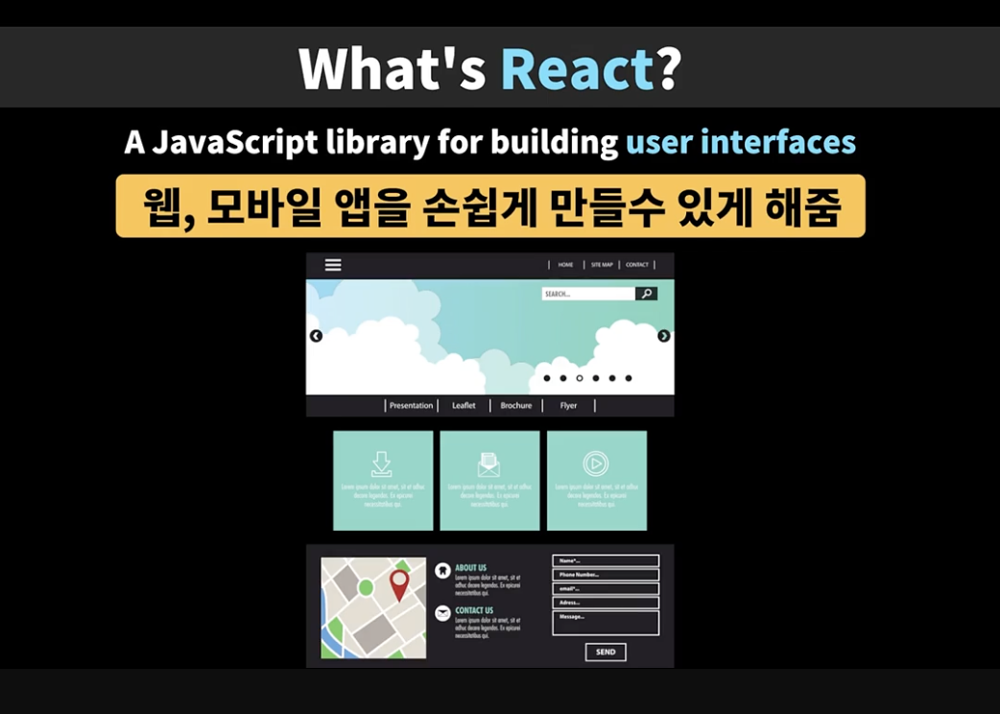
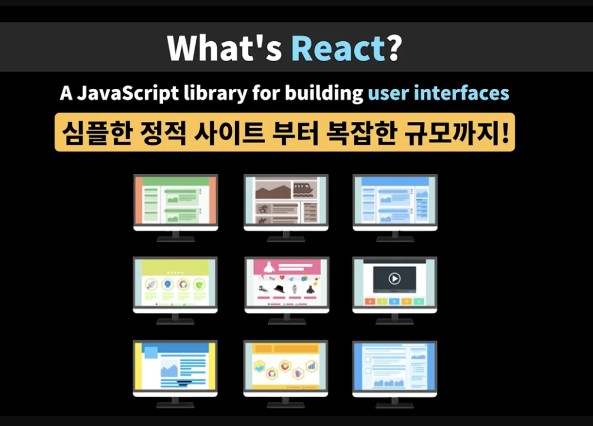
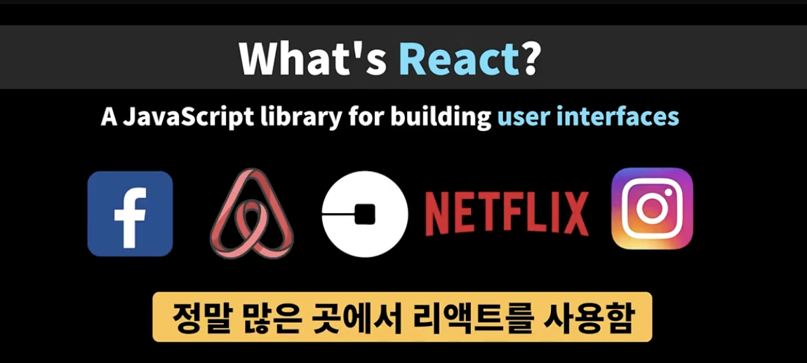
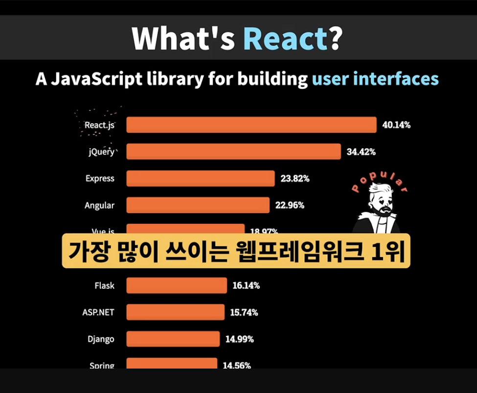
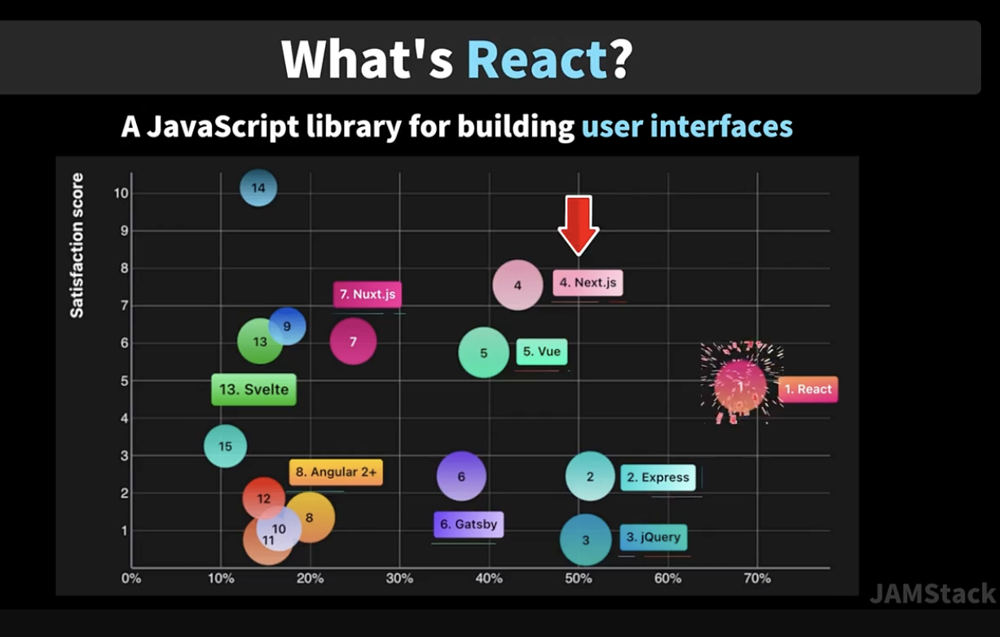
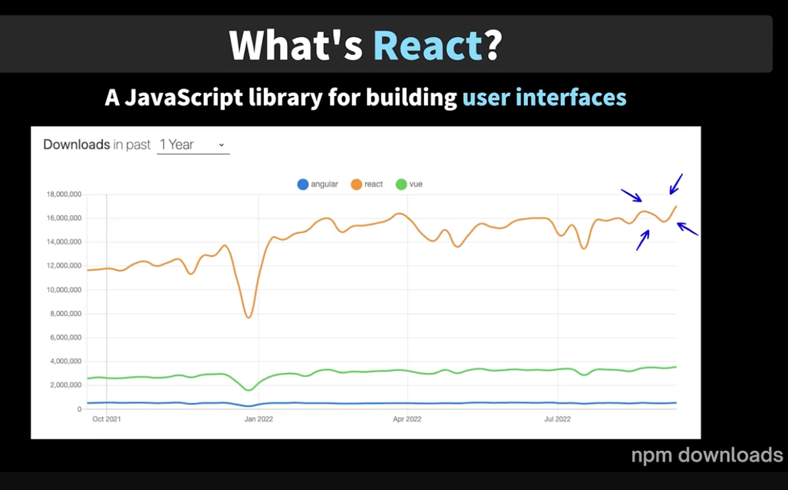
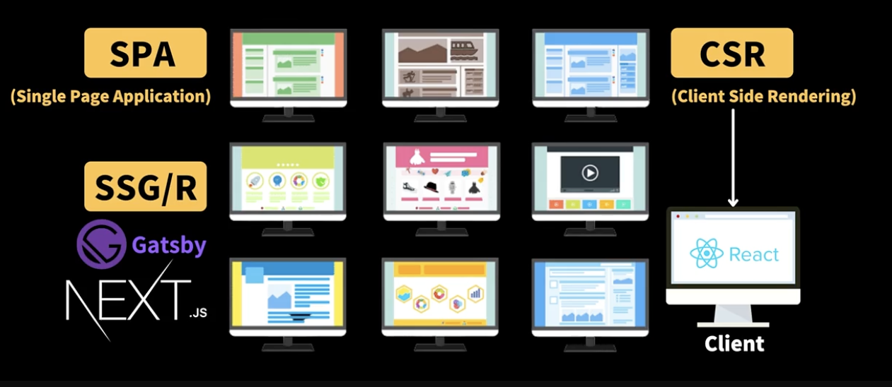

# 📘 React란?

## 1. 학습 목표

- 리액트란 무엇인지, 리액트의 성장과정에 대한 이해하기

## 2. React의 개념 알아보기

### What’s React?

A JavaScript library for building user interfaces.

- 리액트는 자바스크립트 라이브러리
- 2013년도 즈음에 페이스북, 지금은 메타에서 UI 실행 속도 개선을 위해 탄생함.
- 사용자의 이벤트에 즉각적으로 반응해서 UI를 업데이트 할 수 있을까를 고민하여 탄생한 것이 리액트의 시초이다.

 

- 리액트는 UI를 만들 수 있는 라이브러리 인데, 웹 뿐만 아니라 모바일 앱을 손쉽게 만들 수 있게 해준다.

 

- 그리고, 심플한 정적 사이트 뿐만 아니라 복잡한 규모까지 리액트를 이용해서 어플리케이션을 만들어 볼 수 있다.

 

- 페이스북 이제는 메타인가요? 에어비앤비, 우버, 넷플렉스, 인스타그램 정말 많은 곳에서 리액트로 어플리케이션을 만들고 있다.

 

- 매년 실시하는 설문조사에서 가장많이 사랑받고 많이 쓰이는 웹 프레임워크 1위를 당당히 차지했다. 그리고, 가장 많이 쓰이면서 만족도도 높은 것이 리액트이다.

 

- 리액트보다 만족도가 더 높은 Next.js도 리액트를 이용해서 만들기 때문에 리액트를 배워두면 Next.js에 SSR(Server Side Rendering)까지 간편하게 만들어 볼 수 있다.

 

- 앵귤러나 뷰와 같은 다른 프레임워크의 다운로드 숫자만 비교해보아도 리액트가 압도적으로 많은 것을 확인해 볼 수 있다.

 

- 리액트 개발 방식
    - SPA(Single Page Application)
        
        한 어플리케이션 안에서 컴포넌트들을 기능에 따라 숨기고 보여주면서 한 페이지내에서 자유자재로 네비게이션 할 수 있는 것을 말한다. 
        
    - CSR(Client Side Rendering)
        
        사용자가 웹 애플리케이션에 접속했을 때 바로 HTML을 보는 것이 아니라 우리가 작성한 코드 자바스크립트 뿐만아니라, 리액트 라이브러리도 함께 다운로드 받은 후에 사용자의 화면에 UI가 표기되기 때문에 클라이언트 측에서 렌더링이 일어난다.
        
 