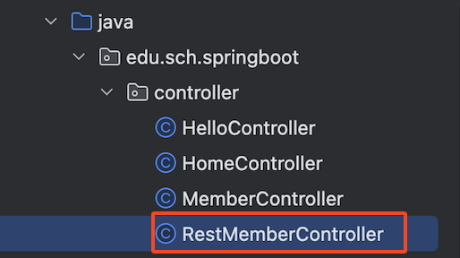
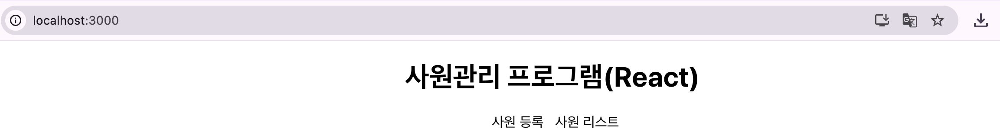

# 📘 사원 관리 로직 - 스프링부트와 연동

## 1. 학습 목표

- 스프링 부트와 사원 관리 연동하기

## 2. 사원 관리 로직 - 스프링부트와 연동

### 2.1 스프링부트 - Employee.java

```java
package com.sch.springboot.dto;

public class Employee {
    private Long sno;
    private String name;
    private String address;

    public Long getSno() {
        return sno;
    }

    public void setSno(Long sno) {
        this.sno = sno;
    }

    public String getAddress() {
        return address;
    }

    public void setAddress(String address) {
        this.address = address;
    }

    public String getName() {
        return name;
    }

    public void setName(String name) {
        this.name = name;
    }
}

```

### 2.2 스프링부트 - RestEmployeeController.java

<br><br>

```java
package com.sch.springboot.controller;

import com.sch.springboot.dto.Employee;
import org.springframework.web.bind.annotation.*;

import java.util.ArrayList;
import java.util.List;

@RestController
@RequestMapping("/api")
@CrossOrigin(origins = "http://localhost:3000") // React 개발 서버 주소
public class RestEmployeeController {

    List<Employee> employees = new ArrayList<Employee>();

    /**
     * 사원 등록
     */
    @PostMapping("/employees/register")
    public String register(@RequestBody Employee employee) {
        System.out.println(employee.getName());
        System.out.println(employee.getAddress());
        employees.add(employee);

        return "ok";
    }

    /**
     * 사원 리스트 조회
     */
    @GetMapping("/employees")
    public  List<Employee> list() {
        System.out.println(employees.size());
        return employees;
    }
}


```

### 2.3 React 프로젝트와 스프링 부트 연동 실행

**1) React 실행 - http://localhost:3000/**

Terminal > New Terminal 실행

명령어 > nodemon start

<br><br>

**2) Spring boot 실행 - http://localhost:8080/**

<br><br>

<!-- [실행 결과]

[화면 기록 2024-08-21 오후 4.47.22.mov](7-4%20%ED%9A%8C%EC%9B%90%20%EA%B4%80%EB%A6%AC%20%EB%A1%9C%EC%A7%81%20-%20%EC%8A%A4%ED%94%84%EB%A7%81%EB%B6%80%ED%8A%B8%EC%99%80%20%EC%97%B0%EB%8F%99%20254bc73a7cba8165a311fb7de29970c6/%25E1%2584%2592%25E1%2585%25AA%25E1%2584%2586%25E1%2585%25A7%25E1%2586%25AB_%25E1%2584%2580%25E1%2585%25B5%25E1%2584%2585%25E1%2585%25A9%25E1%2586%25A8_2024-08-21_%25E1%2584%258B%25E1%2585%25A9%25E1%2584%2592%25E1%2585%25AE_4.47.22.mov) -->
