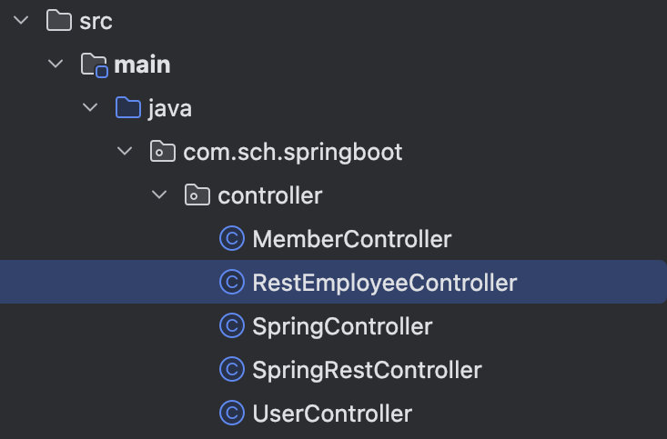
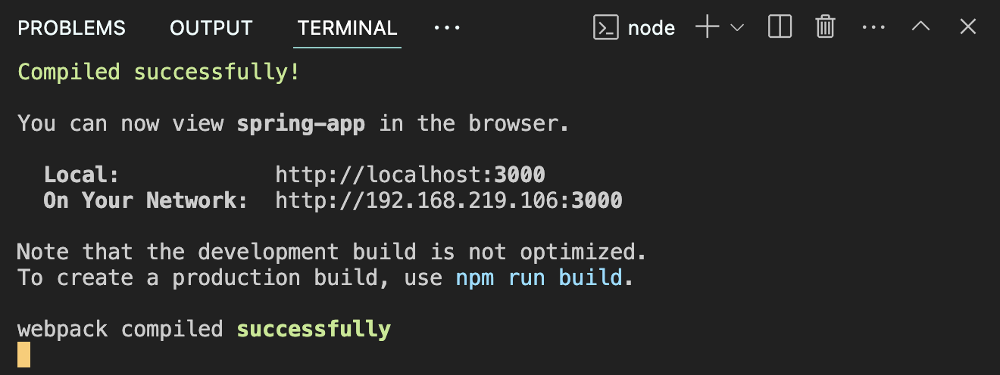

# 📘 사원 관리 로직 - 스프링부트와 연동

## 1. 학습 목표

- 스프링 부트와 사원 관리 연동하기

## 2. 사원 관리 로직 - 스프링부트와 연동

### 2.1 스프링 부트 - RestMemberController.java

<br><br>

```java
package edu.sch.springboot.controller;

import edu.sch.springboot.domain.Member;
import edu.sch.springboot.dto.MemberDto;
import edu.sch.springboot.service.MemberService;
import org.springframework.beans.factory.annotation.Autowired;
import org.springframework.http.ResponseEntity;
import org.springframework.ui.Model;
import org.springframework.web.bind.annotation.*;

import java.util.List;

@RestController
@RequestMapping("/api")
@CrossOrigin(origins = "http://localhost:3000") // React 개발 서버 주소
public class RestMemberController {

    private final MemberService memberService;

    @Autowired
    public RestMemberController(MemberService memberService) {
        this.memberService = memberService;
    }

    /**
     * 회원 등록
     */
    @PostMapping("/members/signup")
    public String signup(@RequestBody MemberDto memberDto) {
        System.out.println(memberDto.getName());
        Member member = new Member();
        member.setName(memberDto.getName());

        memberService.join(member);

        return "ok";
    }

    /**
     * 회원 리스트 조회
     */
    @GetMapping("/members")
    public ResponseEntity<List<Member>> list(Model model) {
        List<Member> members = memberService.findMembers();
        return ResponseEntity.ok(members);
    }
}

```

### 2.2 리액트 - src/App.js :: axios를 이용하여 백엔드(스프링부트)와 연동

```jsx
import "./App.css";
import { useState, useEffect } from "react";
import axios from "axios";

export default function App() {
  const [page, setPage] = useState("home");

  function handleChangePage(page) {
    setPage(page);
  }

  return (
    <div className="App">
      <h1>Springboot :: 회원관리 프로그램(React)</h1>
      {page === "home" && (
        <p>
          <span className="App-link" onClick={() => handleChangePage("signup")}>
            회원 가입{" "}
          </span>
          <span className="App-link" onClick={() => handleChangePage("list")}>
            회원 리스트
          </span>
        </p>
      )}
      {page === "signup" && <Signup handleChangePage={handleChangePage} />}
      {page === "list" && <MemberList handleChangePage={handleChangePage} />}
    </div>
  );
}

/**
 * 회원 등록 컴포넌트
 */
function Signup(props) {
  const [name, setName] = useState("");

  function handleSignup() {
    //스프링 부트 호출 및 연동
    const data = { name: name };
    axios
      .post("http://localhost:8080/api/members/signup", data)
      .then((response) => {
        if (response.data === "ok") {
          alert("가입이 완료되었습니다");
          props.handleChangePage("home");
        }
      })
      .catch((error) => {
        console.log(error);
      });
  }

  return (
    <div className="App">
      <form>
        <div>
          <label htmlFor="name">이름</label>
          <input
            type="text"
            id="name"
            name="name"
            placeholder="이름을 입력하세요"
            onChange={(e) => {
              setName(e.target.value);
            }}
          />
        </div>
        <button type="button" onClick={handleSignup}>
          가입하기
        </button>
      </form>
    </div>
  );
}

/**
 * 회원 리스트 컴포넌트
 */
function MemberList(props) {
  const [memberList, setMemberList] = useState([]);

  useEffect(() => {
    axios
      .get("http://localhost:8080/api/members")
      .then((response) => {
        console.log(response.data);
        setMemberList(response.data);
      })
      .catch((error) => console.log(error));
  }, []);

  return (
    <div>
      <table className="App-memberList-table">
        <thead>
          <tr>
            <th>#</th>
            <th>이름</th>
          </tr>
        </thead>
        <tbody>
          {memberList.map((member) => (
            <tr key={member.id}>
              <td>{member.id}</td>
              <td>{member.name}</td>
            </tr>
          ))}
        </tbody>
      </table>
      <p>
        <span
          className="App-link"
          onClick={() => props.handleChangePage("home")}
        >
          홈으로
        </span>
        <span
          className="App-link"
          onClick={() => props.handleChangePage("signup")}
        >
          회원 가입
        </span>
      </p>
    </div>
  );
}
```

### 2.3 React 프로젝트와 스프링 부트 연동 실행

**1) React 실행 - http://localhost:3000/**

Terminal > New Terminal 실행

명령어 > nodemon start

<br><br>

**2) Spring boot 실행 - http://localhost:8080/**

<br><br>

<!-- [실행 결과]

[화면 기록 2024-08-21 오후 4.47.22.mov](7-4%20%ED%9A%8C%EC%9B%90%20%EA%B4%80%EB%A6%AC%20%EB%A1%9C%EC%A7%81%20-%20%EC%8A%A4%ED%94%84%EB%A7%81%EB%B6%80%ED%8A%B8%EC%99%80%20%EC%97%B0%EB%8F%99%20254bc73a7cba8165a311fb7de29970c6/%25E1%2584%2592%25E1%2585%25AA%25E1%2584%2586%25E1%2585%25A7%25E1%2586%25AB_%25E1%2584%2580%25E1%2585%25B5%25E1%2584%2585%25E1%2585%25A9%25E1%2586%25A8_2024-08-21_%25E1%2584%258B%25E1%2585%25A9%25E1%2584%2592%25E1%2585%25AE_4.47.22.mov) -->
