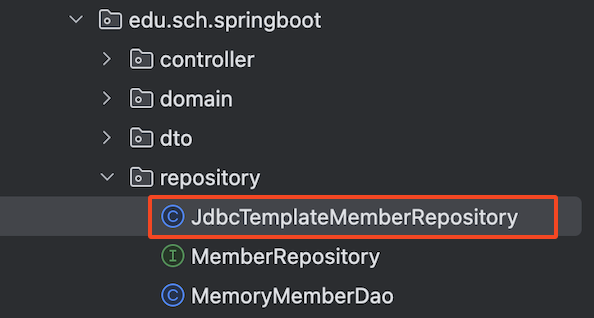

# 📘 스프링 jdbcTemplate

## 1. 학습 목표

- jdbcTemplate 실행

## 2. 스프링 jdbcTemplate

💡 jdbcTemplate API 주소
:: <br> [https://docs.spring.io/spring-framework/docs/current/javadoc- api/org/springframework/jdbc/core/JdbcTemplate.html](https://docs.spring.io/spring-framework/docs/current/javadoc-api/org/springframework/jdbc/core/JdbcTemplate.html)

<br>

### 2.1 JdbcTemplateMemberRepository.java

<br><br>

```java
package edu.sch.springboot.repository;

import edu.sch.springboot.domain.Member;
import org.springframework.jdbc.core.JdbcTemplate;
import org.springframework.jdbc.core.RowMapper;
import org.springframework.stereotype.Repository;

import javax.sql.DataSource;
import java.util.List;
import java.util.Optional;

@Repository
public class JdbcTemplateMemberRepository implements MemberRepository{

    private final JdbcTemplate jdbcTemplate;

    public JdbcTemplateMemberRepository(DataSource dataSource) {
        this.jdbcTemplate = new JdbcTemplate(dataSource);
    }

    /** 회원 가입 */
    @Override
    public Member save(Member member) {
        String sql = "insert into member (name, sdate) VALUES (?, now())";
        jdbcTemplate.update(sql, member.getName());
        return member;
    }

    /** 회원  조회 */
    @Override
    public Optional<Member> findById(Long id) {
        String sql = "select * from member where id = ?";
        List<Member> result = jdbcTemplate.query(sql, memberRowMapper(), id);
        return result.stream().findAny();
    }

    /** 회원 이름 조회 */
    @Override
    public Optional<Member> findByName(String name) {
        String sql = "select * from member where name = ?";
        List<Member> result = jdbcTemplate.query(sql, memberRowMapper(), name);
        return result.stream().findAny();
    }

    /** 회원 리스트 조회 */
    @Override
    public List<Member> findAll() {
        String sql = "select * from member";
        return jdbcTemplate.query(sql, memberRowMapper());
    }

    /** 반환 타입 정의 객체 */
    private RowMapper<Member> memberRowMapper() {
        return ((rs, rowNum) -> {
            Member member = new Member();
            member.setId(rs.getLong("id"));
            member.setName(rs.getString("name"));
            return member;
        });
    }
}
```

<br>

### 2.2 MemberService.java

- memberDao 객체의 클래스 타입 ⇒ JdbcTemplateMemberRepository 클래스 타입으로 수정

```java
package edu.sch.springboot.service;

import edu.sch.springboot.domain.Member;
import edu.sch.springboot.repository.JdbcTemplateMemberRepository;
import edu.sch.springboot.repository.MemberRepository;
import org.springframework.beans.factory.annotation.Autowired;
import org.springframework.stereotype.Service;

import java.util.List;
import java.util.Optional;

@Service
public class MemberService {
    private final JdbcTemplateMemberRepository memberDao;

    @Autowired
    public MemberService(JdbcTemplateMemberRepository memberDao) {
        this.memberDao = memberDao;
    }

    /**
     * 회원 가입
     * */
    public Long join(Member member) {
        //동일한 이름의 중복회원 X
        duplicatedMemberCheck(member);

        memberDao.save(member);
        return member.getId();
    }

    private void duplicatedMemberCheck(Member member) {
        memberDao.findByName(member.getName())
                .ifPresent(m -> {
                   throw new IllegalStateException("이미 존재하는 회원입니다.");
                });
    }

    /**
     * 전체 회원 조회
     */
    public List<Member> findMembers() {
        return memberDao.findAll();
    }

    /**
     * 회원 ID 조회
     **/
    public Optional<Member> findMemberId(Long memberId) {
        return memberDao.findById(memberId);
    }

}

```

<!-- ### 2.3 실행 결과 -->

<!-- [Thymeleaf]

[화면 기록 2024-08-22 오후 3.07.05.mov](8-4%20%EC%8A%A4%ED%94%84%EB%A7%81%20jdbcTemplate%20254bc73a7cba81dba18df118bec5fe05/%25E1%2584%2592%25E1%2585%25AA%25E1%2584%2586%25E1%2585%25A7%25E1%2586%25AB_%25E1%2584%2580%25E1%2585%25B5%25E1%2584%2585%25E1%2585%25A9%25E1%2586%25A8_2024-08-22_%25E1%2584%258B%25E1%2585%25A9%25E1%2584%2592%25E1%2585%25AE_3.07.05.mov)

[React]

[화면 기록 2024-08-22 오후 3.09.20.mov](8-4%20%EC%8A%A4%ED%94%84%EB%A7%81%20jdbcTemplate%20254bc73a7cba81dba18df118bec5fe05/%25E1%2584%2592%25E1%2585%25AA%25E1%2584%2586%25E1%2585%25A7%25E1%2586%25AB_%25E1%2584%2580%25E1%2585%25B5%25E1%2584%2585%25E1%2585%25A9%25E1%2586%25A8_2024-08-22_%25E1%2584%258B%25E1%2585%25A9%25E1%2584%2592%25E1%2585%25AE_3.09.20.mov) -->
