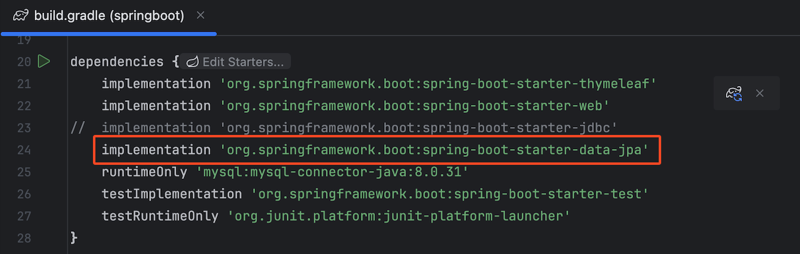
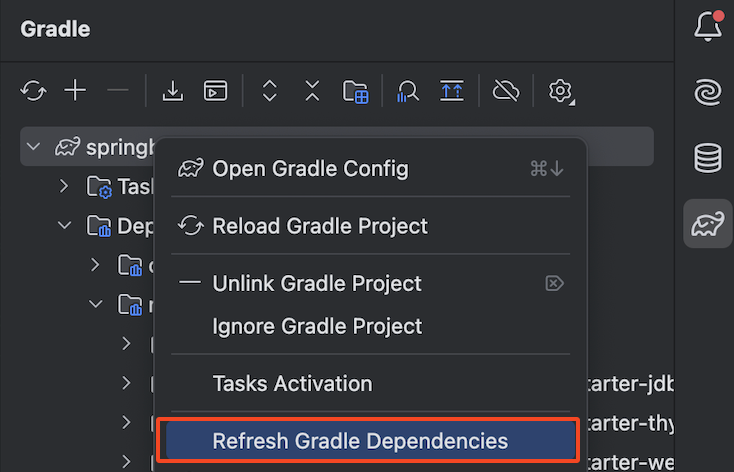
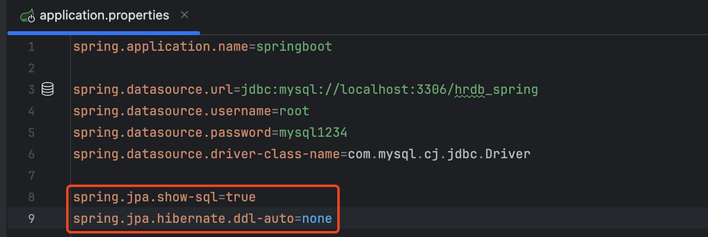
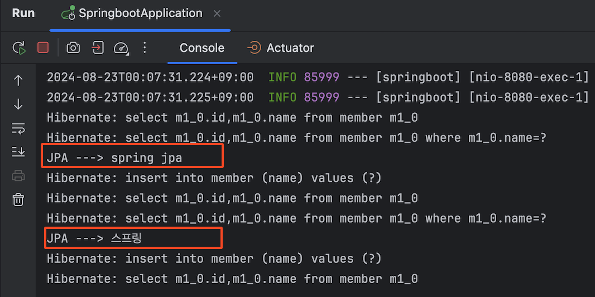
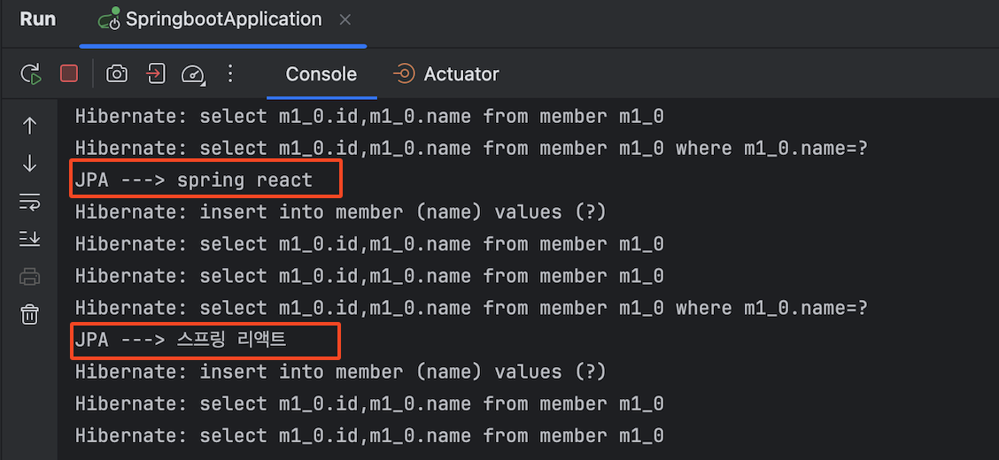

# 📘 JPA 실습

## 1. 학습 목표

- JPA(Java Persistence API) 실습

## 2. JPA 실습

### 2.1 JPA 라이브러리 의존성 추가

- build.gradle

```java
  implementation 'org.springframework.boot:spring-boot-starter-data-jpa'
	runtimeOnly 'mysql:mysql-connector-java:8.0.31'
```

<br><br>

- Gradle 리프레쉬

<br><br>

- application.properties 추가

```java
spring.jpa.show-sql=true
spring.jpa.hibernate.ddl-auto=none
```

<br><br>

### 2.2 Entity 객체 생성

- 라이브러리 설치 확인 - External Libraries
- 기존 domain/Member.java ⇒ Entitly 객체로 전환

```java
package edu.sch.springboot.domain;

import jakarta.persistence.Entity;
import jakarta.persistence.GeneratedValue;
import jakarta.persistence.GenerationType;
import jakarta.persistence.*;

@Entity  //JPA가 관리하는 객체가 됨
public class Member {

    @Id
    @GeneratedValue(strategy = GenerationType.IDENTITY)
    private Long id;

    private String name;

    public Long getId() {
        return id;
    }

    public void setId(Long id) {
        this.id = id;
    }

    public String getName() {
        return name;
    }

    public void setName(String name) {
        this.name = name;
    }
}
```

### 2.3 JPA용 Repository 객체 생성

- repository/JpaMemberRepository.java

```java
package edu.sch.springboot.repository;

import edu.sch.springboot.domain.Member;
import jakarta.persistence.EntityManager;
import org.springframework.stereotype.Repository;
import java.util.List;
import java.util.Optional;

@Repository
public class JpaMemberRepository implements MemberRepository{

    private final EntityManager em;

    public JpaMemberRepository(EntityManager em) {
        this.em = em;
    }

    @Override
    public Member save(Member member) {
        em.persist(member);
        return member;
    }

    @Override
    public Optional<Member> findById(Long id) {
        Member member = em.find(Member.class, id);
        return Optional.ofNullable(member);
    }

    @Override
    public Optional<Member> findByName(String name) {
        List<Member> result = em.createQuery("select m from Member m where m.name = :name", Member.class)
                .setParameter("name", name)
                .getResultList();

        return result.stream().findAny();
    }

    @Override
    public List<Member> findAll() {
        return em.createQuery("select m from Member m", Member.class)
                .getResultList();
    }
}

```

### 2.4 Service 객체 수정

1. `@Transactional` 어노테이션 추가

- JPA를 사용하여 데이터를 저장하거나 업데이트 할때는 반드시 트랜잭션 작업이 필요함

```java

@Transactional
@Service
public class MemberService {
    private final JdbcTemplateMemberRepository memberDao;

	   ...
```

2. memberDao 객체의 클래스 타입을 JpaMemberRepository로 수정

```java
@Transactional
@Service
public class MemberService {
    private final JpaMemberRepository memberDao;

    @Autowired
    public MemberService(JpaMemberRepository memberDao) {
        this.memberDao = memberDao;
    }
	...
```

<!-- [Thymeleaf] -->

<!-- [화면 기록 2024-08-23 오전 12.07.44.mov](8-7%20JPA%20%EC%8B%A4%EC%8A%B5%20254bc73a7cba817d899bdfc5390334ea/%25E1%2584%2592%25E1%2585%25AA%25E1%2584%2586%25E1%2585%25A7%25E1%2586%25AB_%25E1%2584%2580%25E1%2585%25B5%25E1%2584%2585%25E1%2585%25A9%25E1%2586%25A8_2024-08-23_%25E1%2584%258B%25E1%2585%25A9%25E1%2584%258C%25E1%2585%25A5%25E1%2586%25AB_12.07.44.mov) -->

<br><br>

[React]

<!-- [화면 기록 2024-08-23 오전 12.12.56.mov](8-7%20JPA%20%EC%8B%A4%EC%8A%B5%20254bc73a7cba817d899bdfc5390334ea/%25E1%2584%2592%25E1%2585%25AA%25E1%2584%2586%25E1%2585%25A7%25E1%2586%25AB_%25E1%2584%2580%25E1%2585%25B5%25E1%2584%2585%25E1%2585%25A9%25E1%2586%25A8_2024-08-23_%25E1%2584%258B%25E1%2585%25A9%25E1%2584%258C%25E1%2585%25A5%25E1%2586%25AB_12.12.56.mov) -->

<br><br>
