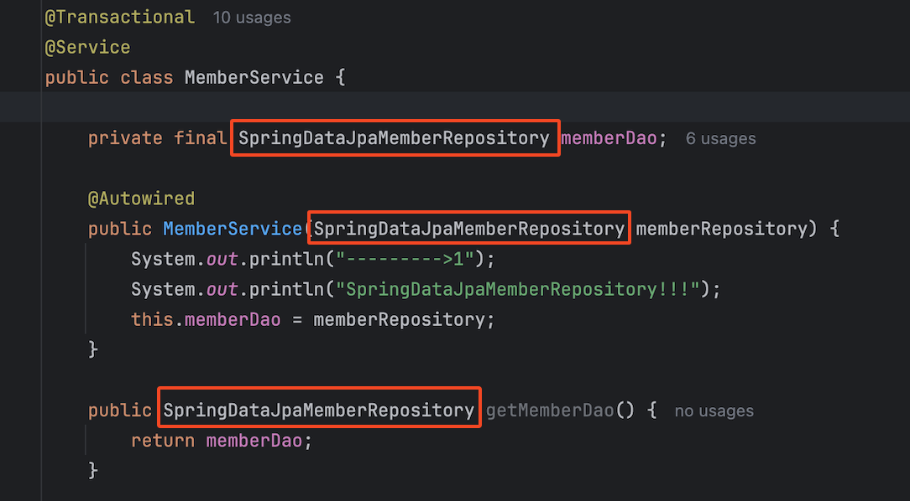
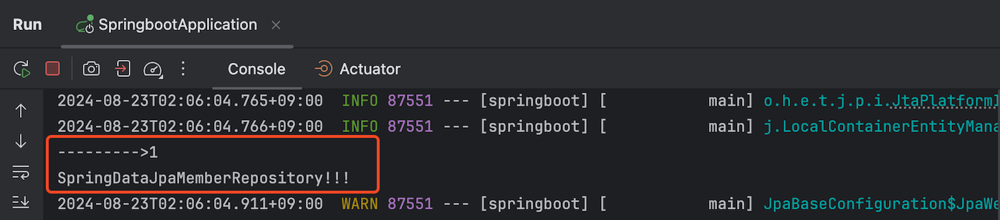

# 📘 Spring JPA 실습

## 1. 학습 목표

- Spring JPA 실습

## 2. Spring JPA 실습

💡 [참고 사항]

- Spring JPA는 스프링에서 JPA를 편하게 사용할 수 있도록 도와주는 역할이므로 정확히 JPA에 대해 숙지해야 함
- JPA 환경 설정을 그대로 사용함
- `JpaRepository` 인터페이스를 상속 받아 작성이 되고, `CrudRepository` 인터페이스가 제공하는 CRUD 메소드(save, findAll…)를 호출해서 사용함
- 제공되는 메소드외의 다른 메소드를 인터페이스로 생성하여 사용하는 경우 해당 인터페이스를 상속받아 정의함
  <br>

### 2.1 Spring JPA Repository 생성

<!-- [꼭 정리하기!!] -->

- `JpaRepository` 인터페이스를 상속받아 생성한다.
- 스프링 실행 시 JpaRepository가 내부적으로 SpringDataJpaMemberRepository 인터페이스의 구현체(클래스 → 객체)를 자동으로 생성하여 호출하는 곳에 주입(Injection) 해준다.
- `JpaRepository` 인터페이스의 상속 구조를 확인하여, `CrudRepository` 의 메소드를 확인한다.
- `CrudRepository` 에서 제공해주는 메소드명과 상속받은 MemberRepository의 메소드명이 동일한 경우 ambiguous(애매모호함) 에러가 발생할 수 있다.
- 상속받은 MemberRepository 인터페이스는 `CrudRepository` 에서 제공되는 메소드명과 다른 경우 별도로 정의하여 상속받아 구현한다.
  <br><br>

1. findByName 메소드를 요소로 하는 MemberRepository2 인터페이스 생성

```java
package edu.sch.springboot.repository;

import edu.sch.springboot.domain.Member;
import java.util.Optional;

public interface MemberRepository2 {
    Optional<Member> findByName(String name);
}
```

2. `SpringDataJpaMemberRepository` **인터페이스** 생성하기

```java
package edu.sch.springboot.repository;

import edu.sch.springboot.domain.Member;
import org.springframework.data.jpa.repository.JpaRepository;
import java.util.Optional;

public interface SpringDataJpaMemberRepository extends JpaRepository<Member, Long>, MemberRepository2 {

    @Override
    Optional<Member> findByName(String name);
}
```

### 2.2 Service 객체에서 Spring Data JPA 인터페이스 호출하기

<br>

```java
package edu.sch.springboot.service;

import edu.sch.springboot.domain.Member;
import edu.sch.springboot.repository.*;
import jakarta.transaction.Transactional;
import org.springframework.beans.factory.annotation.Autowired;
import org.springframework.stereotype.Service;

import java.util.List;
import java.util.Optional;

@Transactional
@Service
public class MemberService {
    private final SpringDataJpaMemberRepository memberDao ;

    @Autowired
    public MemberService(SpringDataJpaMemberRepository memberDao) {
        this.memberDao = memberDao;
    }

    /**
     * 회원 가입
     * */
    public Long join(Member member) {
        duplicatedMemberCheck(member);

        memberDao.save(member);
        return member.getId();
    }

    //회원 name 중복 체크
    private void duplicatedMemberCheck(Member member) {
        memberDao.findByName(member.getName())
                .ifPresent(m -> {
                    throw new IllegalStateException("이미 존재하는 회원입니다.");
                });
    }

    /**
     * 전체 회원 조회
     */
    public List<Member> findMembers() {
        return memberDao.findAll();
    }

    /**
     * 회원 ID 조회
     **/
    public Optional<Member> findMemberId(Long memberId) {
        return memberDao.findById(memberId);
    }

}

```

<br><br>
